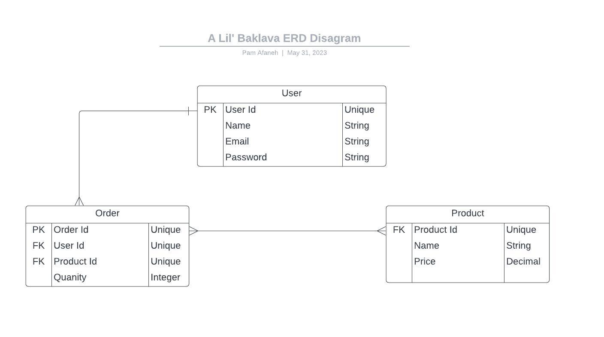

# Al Lil' Baklava - Capstone Project

## Tables of Contents

- [Project Overview](#project-overview)
- [Project Planning](#project-planning)
- [User Stories](#user-stories)
- [ERD Diagram](#erd-diagram)
- [MVP](#mvp-------completed-------not-completed)
- [Installing Dependencies](#installing-dependencies)
- [Wins & Hurdles](#wins--hurdles)
- [Technologies & Tools](#technologies--tools)
- [Credits](#credits)

***

## Project Overview

This is my Capstone project for the Interapt / General Assembly Apprenticeship Cohort. 
The theme of this Capstone is my daughter's baklava business. The project involves 
building both the backend using Java/Springboot and the frontend using Angular.

## Project Planning

### Progress Snapshot 1

<br><br>

### Progress Snapshot 2

<br><br>

### Progress Snapshot 3

<br><br>


[View Planning Kanban Board](https://github.com/users/pammie89/projects/1)

***

## User Stories

- As an admin, I should be able to add products<br>
- As an admin, I should be able to edit products<br>
- As an admin, I should be able to update products<br>
- As an admin, I should be able to delete products<br>
- As an admin, I should be able to view orders<br>
- As an admin, I should be able to update orders<br>
- As an admin, I should be able to get all orders<br>
- As an admin, I should be able to delete orders<br>

***

## ERD Diagram

<br><br>

***

## Rest Endpoints

#### <ins>Order Endpoints</ins>

| Request Type | URL                | Functionality    | Access  |  
|--------------|--------------------|------------------|---------|
| GET          | /orders            | Get all orders   | Private |   
| GET          | /orders/{orderId}/ | Get order by id  | Private |   
| POST         | /orders            | Create New Order | Private |   
| PUT          | /orders/{orderId}/ | Update an order  | Private |
| DEL          | /orders/{orderId}/ | Delete an order  | Private |

#### <ins>Product Endpoints</ins>

| Request Type | URL                    | Functionality     | Access  |  
|--------------|------------------------|-------------------|---------|
| GET          | /products              | Get all products  | Private |   
| GET          | /products/{productId}/ | Get product by id | Private |   
| POST         | /products              | Add new product   | Private |   
| PUT          | /products/{productId}/ | Update a product  | Private |
| DEL          | /products/{productId}/ | Delete an product | Private |

***

## MVP ( - ✓ - Completed / - ✗ - Not Completed)

1. Contain at least 2 models - ✓
2. The environment settings should use Spring Profiles - ✓
3. API endpoints should perform CRUD tasks - ✗
4. Should provide CRUD routes - ✓
5. Handle exceptions gracefully - ✓
6. Should be developed using the TDD approach - ✓
7. Test the controller with MOCK MVC - ✓
8. Use Doc Strings - ✗


## Installing Dependencies

#### List of dependencies used

- SpringBoot
    - Starter REST
    - Dev Tools
    - JPA
    - Plugin/Mavin
- H2 Database
- Junit


#### How to install dependencies

Copy and paste the code below into your pom.xml file. Once copied right mouse click on your pom.xml file and select
Maven and then Reload project. This will install the dependencies.
<br><br>

```
<dependencies>
		<dependency>
			<groupId>org.springframework.boot</groupId>
			<artifactId>spring-boot-starter-data-rest</artifactId>
		</dependency>
		<dependency>
			<groupId>org.springframework.boot</groupId>
			<artifactId>spring-boot-devtools</artifactId>
			<scope>runtime</scope>
			<optional>true</optional>
		</dependency>
		<dependency>
			<groupId>org.springframework.boot</groupId>
			<artifactId>spring-boot-starter-jdbc</artifactId>
		</dependency>
		<dependency>
			<groupId>org.springframework.boot</groupId>
			<artifactId>spring-boot-starter-test</artifactId>
			<scope>test</scope>
		</dependency>
		<dependency>
			<groupId>junit</groupId>
			<artifactId>junit</artifactId>
			<scope>test</scope>
		</dependency>
		<dependency>
			<groupId>com.h2database</groupId>
			<artifactId>h2</artifactId>
			<scope>runtime</scope>
		</dependency>
		<dependency>
			<groupId>org.mockito</groupId>
			<artifactId>mockito-core</artifactId>
			<version>3.11.2</version>
			<scope>test</scope>
		</dependency>
		<dependency>
			<groupId>org.springframework.boot</groupId>
			<artifactId>spring-boot-starter-data-jpa</artifactId>
		</dependency>
		<dependency>
			<groupId>org.junit.jupiter</groupId>
			<artifactId>junit-jupiter-api</artifactId>
			<version>5.8.0</version>
			<scope>test</scope>
		</dependency>
		<dependency>
			<groupId>org.springframework.boot</groupId>
			<artifactId>spring-boot-starter-web</artifactId>
		</dependency>
		<dependency>
			<groupId>org.springframework.boot</groupId>
			<artifactId>spring-boot-starter-test</artifactId>
			<scope>test</scope>
		</dependency>
	</dependencies>


```

***

## Technologies & Tools

- Java
- Spring Boot
- Postman
- GitHub Project
- LucidChart
- H2 Database
- JUnit
- Mockito


***

## Credits

- I utilized [LucidChart](https://lucidchart.com/) for creating the ERD diagrams.

- I want to express my heartfelt gratitude to [Suresh](https://github.com/sureshmelvinsigera), [Leo](https://github.com/LRodriguez92) and [Dhrubo](https://www.linkedin.com/in/dhrubo-hasan/).   Their teachings over the past three months made it possible for me to finish building a full stack app using Java/Springboot and Angular. I couldn't have done it without them!
- I would also like to thank my colleague [Jeff Ou](https://www.linkedin.com/in/jiajin-ou-87330a1b1/), who was so kind to take the time to help me with an issue I had with my order model.  Thank you very much!