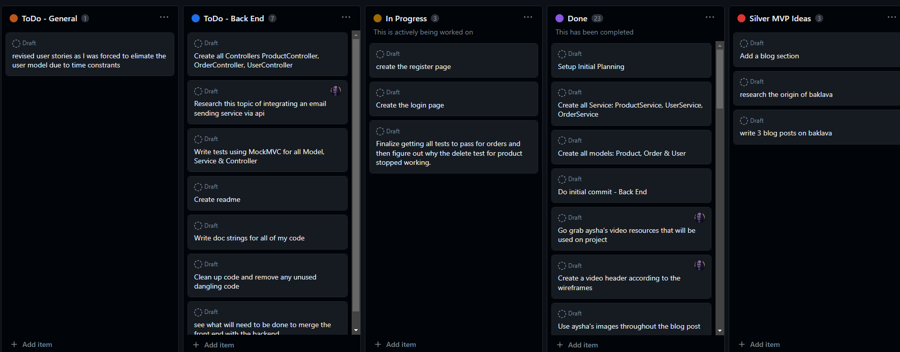
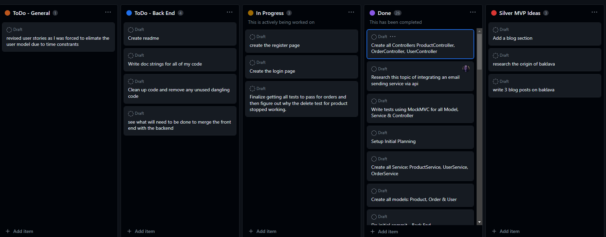

# Al Lil' Baklava - Capstone Project

## Tables of Contents

- [Project Overview](#project-overview)
- [Project Planning](#project-planning)
- [User Stories](#user-stories)
- [ERD Diagram](#erd-diagram)
- [MVP](#mvp-------completed-------not-completed)
- [Favorite Parts](#favorite-parts)
- [Wins & Hurdles](#wins--hurdles)
- [Technologies & Tools](#technologies--tools)
- [Credits](#credits)

***

## Project Overview

This is my Capstone project for the Interapt / General Assembly Apprenticeship Cohort. 
The theme of this Capstone is my daughter's baklava business. The project involves 
building both the backend using Java/Springboot and the frontend using Angular.

## Project Planning

### Progress Snapshot 1

  

### Progress Snapshot 2

  

### Progress Snapshot 3

  

[View Planning Kanban Board](https://github.com/users/pammie89/projects/1)

***

## User Stories

- As an admin, I should be able to add products 
- As an admin, I should be able to edit products 
- As an admin, I should be able to update products 
- As an admin, I should be able to delete products 
- As an admin, I should be able to view orders 
- As an admin, I should be able to update orders 
- As an admin, I should be able to get all orders 
- As an admin, I should be able to delete orders 

## ERD Diagram